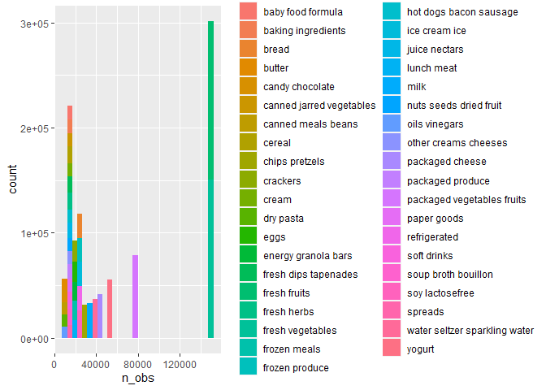
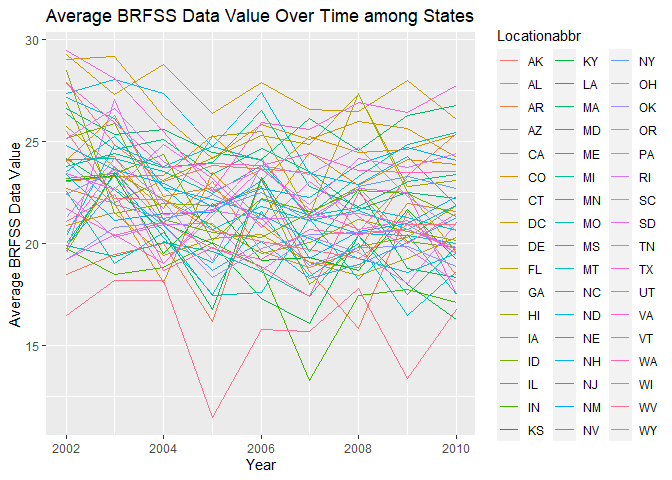
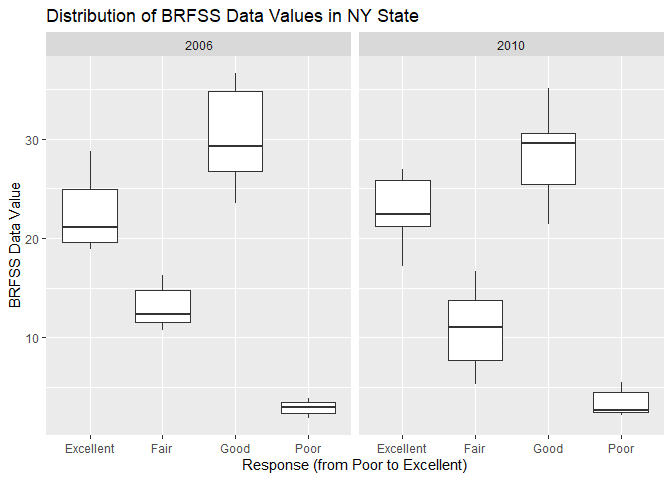
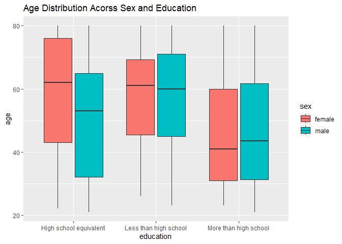
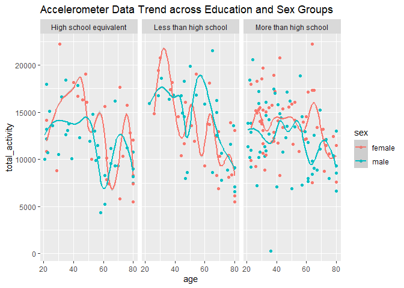
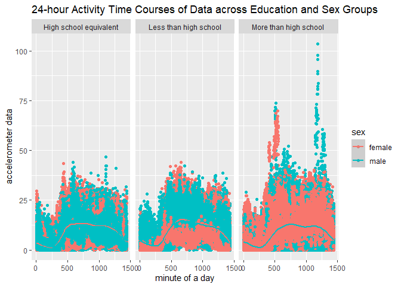

p8105_hw3_zh2596
================
Zilin Huang
2023-10-14

``` r
library(tidyverse)
library(ggplot2)
library(patchwork)
library(readr)
library(dplyr)
library(p8105.datasets)
data("instacart")
data("brfss_smart2010")
```

## Problem 1

This dataset shows the order status of a specific group of customers.
with the orders’ information and date recorded.

There are `nrow(instacart)` rows and `ncol(instacart)` columns in the
`instacart` dataset. Some key variables include `user_id` that
identifies unique users, `order_id` that identifies unique orders,
`aisle_id`, `department_id` that identify the category that the product
belongs to, etc.

As an example, on row 9, a customer with user id `79431` orders
`Grated Pecorino Romano Cheese`, one of his/her eight orders on Saturday
at 6 p.m. He/she has never ordered this product before.

### How many aisles are there, and which aisles are the most items ordered from?

``` r
instacart |>
  group_by(aisle) |>
  summarize(n_obs = n()) |>
  arrange(desc(n_obs))
```

    ## # A tibble: 134 × 2
    ##    aisle                          n_obs
    ##    <chr>                          <int>
    ##  1 fresh vegetables              150609
    ##  2 fresh fruits                  150473
    ##  3 packaged vegetables fruits     78493
    ##  4 yogurt                         55240
    ##  5 packaged cheese                41699
    ##  6 water seltzer sparkling water  36617
    ##  7 milk                           32644
    ##  8 chips pretzels                 31269
    ##  9 soy lactosefree                26240
    ## 10 bread                          23635
    ## # ℹ 124 more rows

There are 134 aisles, and based on the code chunk above,
`fresh vegetables` contains the most items ordered from.

### Make a plot that shows the number of items ordered in each aisle, limiting this to aisles with more than 10000 items ordered. Arrange aisles sensibly, and organize your plot so others can read it.

This step limits the plot to aisles with more than 10000 items ordered.

``` r
instacart |>
  group_by(aisle) |>
  mutate(n_obs = n()) |>
  arrange(desc(n_obs)) |>
  filter(n_obs > 10000) |>
  ggplot(aes(x = n_obs, fill = aisle)) + 
    geom_histogram()
```

    ## `stat_bin()` using `bins = 30`. Pick better value with `binwidth`.

<!-- -->

### Make a table showing the three most popular items in each of the aisles “baking ingredients”, “dog food care”, and “packaged vegetables fruits”. Include the number of times each item is ordered in your table.

``` r
instacart |>   
  filter(aisle %in% 
         c("baking ingrediens", "dog food care", "packaged vegetables fruits")) |>
  group_by(aisle, product_name) |>
  summarize(n_obs=n())
```

    ## `summarise()` has grouped output by 'aisle'. You can override using the
    ## `.groups` argument.

    ## # A tibble: 921 × 3
    ## # Groups:   aisle [2]
    ##    aisle         product_name                                              n_obs
    ##    <chr>         <chr>                                                     <int>
    ##  1 dog food care "174 ; Dentastix&#174 ; Large"                                8
    ##  2 dog food care "5 Meaty Flavors Variety Dog Snacks"                          6
    ##  3 dog food care "6\\\" Free Ranger Bully Stix"                                6
    ##  4 dog food care "Adult Chicken & Rice Dry Dog Food"                          12
    ##  5 dog food care "Adult Complete Nutrition Dry Food for Dogs Bonus"            1
    ##  6 dog food care "Adult Dog Food"                                              7
    ##  7 dog food care "Adult Dog Formula Dog Food"                                  2
    ##  8 dog food care "Adult Grain-Free & Poultry-Free Dog Food"                   11
    ##  9 dog food care "Adult Grain-Free Duck, Sweet Potatoes & Whole Peas Entr…     2
    ## 10 dog food care "Adult Health Small Breed Formula Dry Dog Food"              13
    ## # ℹ 911 more rows

### Make a table showing the mean hour of the day at which Pink Lady Apples and Coffee Ice Cream are ordered on each day of the week; format this table for human readers (i.e. produce a 2 x 7 table)

``` r
instacart |>
  filter(product_name %in% c("Pink Lady Apples", "Coffee Ice Cream")) |>
  group_by(product_name, order_dow) |>
  summarize(mean_hour=mean(order_hour_of_day)) |>
  pivot_wider(names_from=order_dow, values_from=mean_hour)
```

    ## `summarise()` has grouped output by 'product_name'. You can override using the
    ## `.groups` argument.

    ## # A tibble: 2 × 8
    ## # Groups:   product_name [2]
    ##   product_name       `0`   `1`   `2`   `3`   `4`   `5`   `6`
    ##   <chr>            <dbl> <dbl> <dbl> <dbl> <dbl> <dbl> <dbl>
    ## 1 Coffee Ice Cream  13.8  14.3  15.4  15.3  15.2  12.3  13.8
    ## 2 Pink Lady Apples  13.4  11.4  11.7  14.2  11.6  12.8  11.9

## Problem 2

Do some data cleaning for the `BRFSS` data:

``` r
brfss_smart2010 |>
  filter(
    Topic == "Overall Health",
    Response %in% c("Excellent", "Very Good", "Good", "Fair", "Poor")) |>
  mutate(
    Response == forcats::fct_relevel(Response, c("Poor", "Fair", "Good", "Very Good", "Excellent")))
```

    ## # A tibble: 8,500 × 24
    ##     Year Locationabbr Locationdesc     Class Topic Question Response Sample_Size
    ##    <int> <chr>        <chr>            <chr> <chr> <chr>    <chr>          <int>
    ##  1  2010 AL           AL - Jefferson … Heal… Over… How is … Excelle…          94
    ##  2  2010 AL           AL - Jefferson … Heal… Over… How is … Good             208
    ##  3  2010 AL           AL - Jefferson … Heal… Over… How is … Fair             107
    ##  4  2010 AL           AL - Jefferson … Heal… Over… How is … Poor              45
    ##  5  2010 AL           AL - Mobile Cou… Heal… Over… How is … Excelle…          91
    ##  6  2010 AL           AL - Mobile Cou… Heal… Over… How is … Good             224
    ##  7  2010 AL           AL - Mobile Cou… Heal… Over… How is … Fair             120
    ##  8  2010 AL           AL - Mobile Cou… Heal… Over… How is … Poor              66
    ##  9  2010 AL           AL - Tuscaloosa… Heal… Over… How is … Excelle…          58
    ## 10  2010 AL           AL - Tuscaloosa… Heal… Over… How is … Good             171
    ## # ℹ 8,490 more rows
    ## # ℹ 16 more variables: Data_value <dbl>, Confidence_limit_Low <dbl>,
    ## #   Confidence_limit_High <dbl>, Display_order <int>, Data_value_unit <chr>,
    ## #   Data_value_type <chr>, Data_Value_Footnote_Symbol <chr>,
    ## #   Data_Value_Footnote <chr>, DataSource <chr>, ClassId <chr>, TopicId <chr>,
    ## #   LocationID <chr>, QuestionID <chr>, RESPID <chr>, GeoLocation <chr>,
    ## #   `==...` <lgl>

### In 2002, which states were observed at 7 or more locations? What about in 2010?

``` r
brfss_smart2010 |>
  filter(Year == 2002) |>
  group_by(Locationabbr) |>
  summarise(number_of_loctions = n_distinct(Locationdesc)) |>
  filter(number_of_loctions >= 7)
```

    ## # A tibble: 6 × 2
    ##   Locationabbr number_of_loctions
    ##   <chr>                     <int>
    ## 1 CT                            7
    ## 2 FL                            7
    ## 3 MA                            8
    ## 4 NC                            7
    ## 5 NJ                            8
    ## 6 PA                           10

``` r
brfss_smart2010 |>
  filter(Year == 2010) |>
  group_by(Locationabbr) |>
  summarise(number_of_loctions = n_distinct(Locationdesc)) |>
  filter(number_of_loctions >= 7)
```

    ## # A tibble: 14 × 2
    ##    Locationabbr number_of_loctions
    ##    <chr>                     <int>
    ##  1 CA                           12
    ##  2 CO                            7
    ##  3 FL                           41
    ##  4 MA                            9
    ##  5 MD                           12
    ##  6 NC                           12
    ##  7 NE                           10
    ##  8 NJ                           19
    ##  9 NY                            9
    ## 10 OH                            8
    ## 11 PA                            7
    ## 12 SC                            7
    ## 13 TX                           16
    ## 14 WA                           10

By the two tables above, the states abbreviated as “CT”, “FL”, “MA”,
“NC”, “NJ”, “PA” were observed at 7 or more locations inn 2002; while
the states abbreviated as “CA”, “CO”, “FL”, “MA”, “MD”, “NC”, “NE”,
“NJ”, “NY”, “OH” were observed at 7 or more locations inn 2010.

### Construct a dataset that is limited to `Excellent` responses, and contains, year, state, and a variable that averages the data_value across locations within a state. Make a “spaghetti” plot of this average value over time within a state (that is, make a plot showing a line for each state across years – the geom_line geometry and group aesthetic will help).

``` r
brfss_smart2010_new =
  brfss_smart2010 |>
  filter(Response == "Excellent") |>
  select(Year, Locationabbr, Data_value) |>
  group_by(Year,Locationabbr) |>
  mutate(mean_data_value = mean(Data_value, na.rm=TRUE)) |>
  select(-Data_value) 

  ggplot(brfss_smart2010_new, aes(Year, mean_data_value, color=Locationabbr)) +
    geom_line() +
    labs(
      title="Average BRFSS Data Value Over Time among States",
      y="Average BRFSS Data Value"
    )
```

<!-- -->
From the spaghetti plot, we can see that the average BRFSS data centered
around the range of (15, 30) for all states, with some states containing
minimal values (below 15) in different years.

### Make a two-panel plot showing, for the years 2006, and 2010, distribution of data_value for responses (“Poor” to “Excellent”) among locations in NY State

``` r
brfss_smart2010_filter =
  brfss_smart2010 |>
  filter(
    Year %in% c(2006, 2010),
    Response %in% c("Excellent", "Very Good", "Good", "Fair", "Poor"),
    Locationabbr == "NY")

brfss_smart2010_filter |>
    ggplot(aes(x=Response,y=Data_value)) +
    facet_grid(~Year) + 
    geom_boxplot() +
    labs(
      title="Distribution of BRFSS Data Values in NY State",
      x="Response (from Poor to Excellent)",
      y="BRFSS Data Value"
    )
```

<!-- -->

From the two-panel plot, we can see that the BRFSS data of different
responses across the two years do not vary by a lot. On average, the
“Good” response contains the highest data value, while the “Poor”
response contains the lowest data value.

## Problem 3

``` r
# this step exclude participants less than 21 years of age, and those with missing demographic data
nhanes_covar =
  read_csv("./data/nhanes_covar.csv", skip=4) |>
  janitor::clean_names() |>
  filter(age >= 21) |>
  drop_na() |>
  # this step encode data with reasonable variable classes
  mutate(
    sex = 
      case_match(
        sex, 
        1 ~ "male", 
        2 ~ "female"),
    sex = as.factor(sex),
    education =
      case_match(
        education,
        1 ~ "Less than high school",
        2 ~ "High school equivalent",
        3 ~ "More than high school"),
    education = as.factor(education),
    seqn = as.character(seqn)) 

nhanes_accel =
   read_csv("./data/nhanes_accel.csv") |>
   janitor::clean_names() |>
   mutate(seqn = as.character(seqn))
```

``` r
# this steps merges the two tables together
merge_df =
  left_join(nhanes_covar, nhanes_accel, by = "seqn") |>
  pivot_longer(min1:min1440,
               values_to = "accelerometer data",
               names_to = "min")
```

### Produce a reader-friendly table for the number of men and women in each education category, and create a visualization of the age distributions for men and women in each education category. Comment on these items.

``` r
# this step produces the table
nhanes_covar |>
  group_by(sex, education) |>
  summarize(number_of_male_or_female = n())
```

    ## # A tibble: 6 × 3
    ## # Groups:   sex [2]
    ##   sex    education              number_of_male_or_female
    ##   <fct>  <fct>                                     <int>
    ## 1 female High school equivalent                       23
    ## 2 female Less than high school                        28
    ## 3 female More than high school                        59
    ## 4 male   High school equivalent                       35
    ## 5 male   Less than high school                        27
    ## 6 male   More than high school                        56

``` r
# this step creates the plot of the age distributions
merge_df |>
  ggplot(aes(x=education,y=age,fill=sex)) +
  geom_boxplot() +
  labs(
    title="Age Distribution Acorss Sex and Education"
  )
```

<!-- -->

This plot shows that the average age is larger for female receiving an
education level of high school equivalent, while those who receive an
education level of more than high school tend to be younger.

``` r
merge_df =
  merge_df |>
  group_by(seqn) |>
  mutate(total_activity = sum(`accelerometer data`))

ggplot(data=merge_df, aes(x=age,y=total_activity, color=sex)) +
  geom_point() +
  geom_smooth() +
  facet_grid(~education) +
  labs(title="Accelerometer Data Trend across Education and Sex Groups")
```

<!-- -->
The figure shows that in general, men have a lower value of
accelerometer data than women when they receive high school education at
least, while men’s data values is higher than women in the group of
“Less than High School”. For all three groups of education, the data
value has a decreasing trend when both men and women’s age increase.

``` r
merge_df |>
  mutate(min_numeric = as.numeric(substring(min,4))) |>
  ggplot(aes(x=min_numeric, y=`accelerometer data`, color=sex)) +
  geom_point() + 
  geom_smooth() +
  facet_grid(~education) + 
  viridis::scale_fill_viridis(discrete = TRUE) +
  labs(title="24-hour Activity Time Courses of Data across Education and Sex Groups",
       x="minute of a day")
```

<!-- -->

The three-panel plot shows that the 24-hour activity time courses of the
accelerometer data centers around the range of (0, 25) for each
education and sex group. Specifically, female’s data values has a more
centralized focus than male in the group of “More than High School”.
